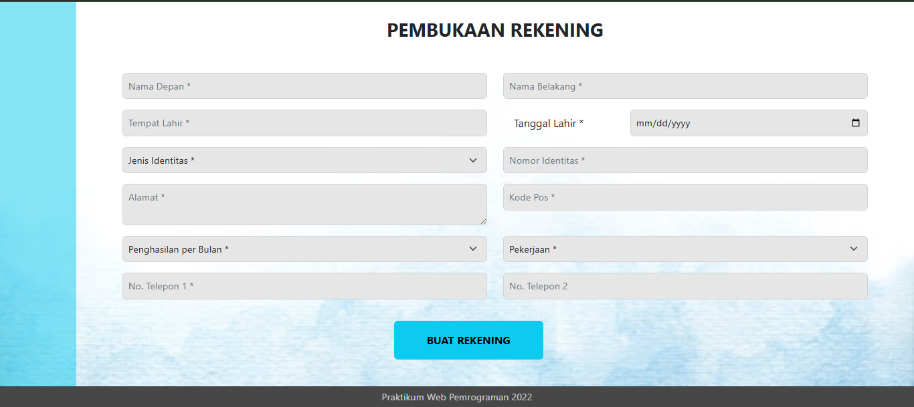
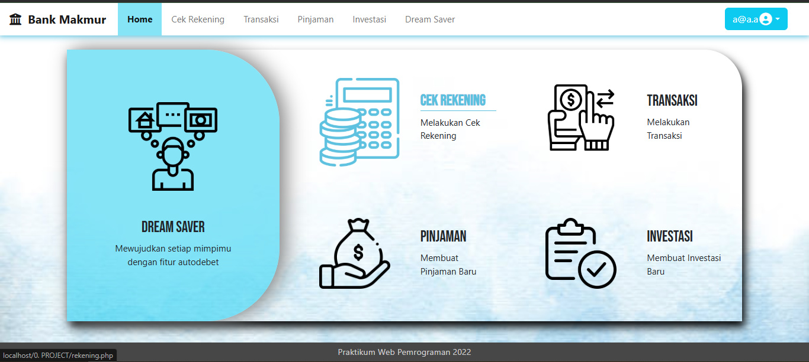
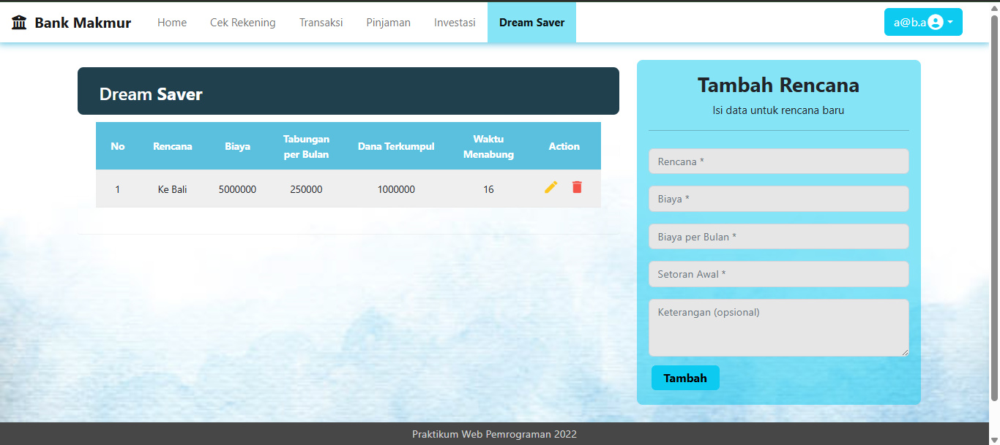
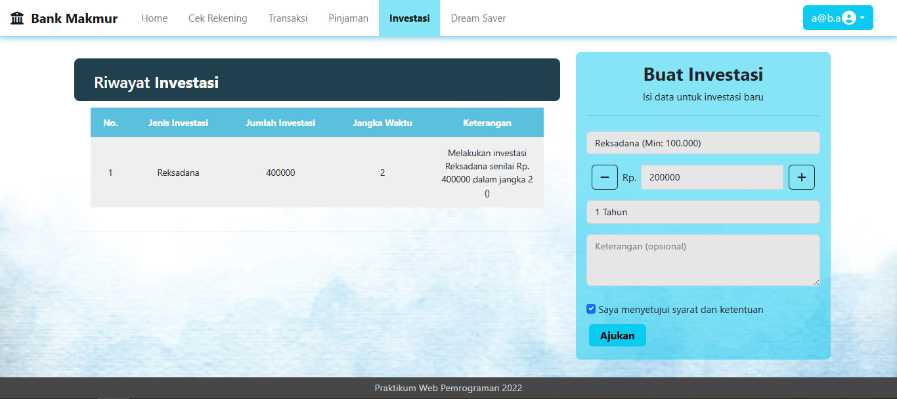
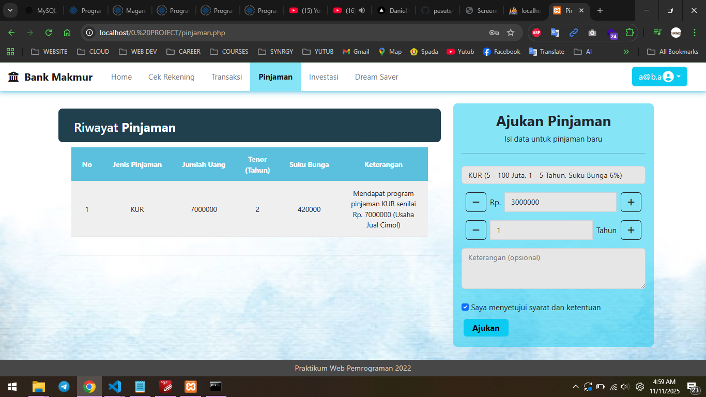

# 🏦 Sistem Informasi Bank Makmur

Aplikasi web banking yang dikembangkan menggunakan PHP native dengan fitur-fitur lengkap untuk manajemen keuangan pribadi, termasuk transaksi, investasi, pinjaman, dan perencanaan keuangan (Dream Saver).

## 📋 Daftar Isi

- [Tentang Aplikasi](#tentang-aplikasi)
- [Fitur Utama](#fitur-utama)
- [Teknologi yang Digunakan](#teknologi-yang-digunakan)
- [Persyaratan Sistem](#persyaratan-sistem)
- [Instalasi](#instalasi)
- [Struktur Database](#struktur-database)
- [Screenshot Aplikasi](#screenshot-aplikasi)
- [Struktur Project](#struktur-project)
- [Penggunaan](#penggunaan)
- [Kontributor](#kontributor)

## 🎯 Tentang Aplikasi

**Bank Makmur** adalah sistem informasi perbankan berbasis web yang dirancang untuk memudahkan nasabah dalam mengelola keuangan mereka secara digital. Aplikasi ini menyediakan berbagai layanan perbankan mulai dari pembukaan rekening, transaksi transfer, pengajuan pinjaman, investasi, hingga perencanaan keuangan jangka panjang.

## ✨ Fitur Utama

### 1. 🔐 Autentikasi Pengguna
- **Login**: Sistem login dengan validasi email dan password
- **Registrasi**: Pendaftaran akun baru untuk calon nasabah
- **Session Management**: Pengelolaan sesi pengguna untuk keamanan
- **Logout**: Keluar dari sistem dengan aman

### 2. 👤 Manajemen Akun
- **Profil Pengguna**: Melihat dan mengedit informasi pribadi
- **Buka Rekening**: Pembukaan rekening baru dengan formulir lengkap
- **Cek Rekening**: Melihat detail informasi rekening

### 3. 💸 Transaksi
- **Transfer Antar Rekening**: Melakukan transfer ke rekening lain
- **Daftar Rekening Tujuan**: Menyimpan daftar rekening yang sering digunakan
- **Riwayat Transaksi**: Melihat histori semua transaksi
- **Mutasi Rekening**: Laporan mutasi lengkap dengan detail

### 4. 💰 Dream Saver (Perencanaan Keuangan)
- **Buat Rencana**: Membuat target tabungan untuk mimpi/tujuan tertentu
- **Perhitungan Otomatis**: Sistem menghitung tabungan per bulan dan tenor
- **Tracking Dana**: Memantau dana yang telah terkumpul
- **Edit & Hapus**: Mengelola rencana keuangan yang sudah dibuat

### 5. 💳 Pinjaman
- **Pengajuan Pinjaman**: Mengajukan berbagai jenis pinjaman (KUR, dll)
- **Simulasi Bunga**: Perhitungan otomatis suku bunga dan cicilan
- **Riwayat Pinjaman**: Melihat histori pengajuan pinjaman

### 6. 📈 Investasi
- **Produk Investasi**: Berbagai pilihan investasi (Reksadana, dll)
- **Tracking Investasi**: Memantau investasi yang sedang berjalan
- **Perhitungan Tenor**: Sistem menghitung jangka waktu investasi

## 🛠 Teknologi yang Digunakan

### Backend
- **PHP**: Bahasa pemrograman utama (native, tanpa framework)
- **MySQL**: Database management system
- **Session PHP**: Untuk manajemen autentikasi dan otorisasi

### Frontend
- **HTML5**: Struktur halaman web
- **CSS3**: Styling dan layout
- **Bootstrap 5**: Framework CSS untuk responsive design
- **JavaScript**: Interaktivitas pada sisi client

### Tools & Environment
- **XAMPP/WAMP**: Local development server
- **phpMyAdmin**: Database management interface
- **Git**: Version control system

## 📦 Persyaratan Sistem

- **PHP**: Versi 7.4 atau lebih tinggi
- **MySQL**: Versi 5.7 atau lebih tinggi
- **Web Server**: Apache 2.4+
- **Web Browser**: Chrome, Firefox, Edge (versi terbaru)
- **RAM**: Minimum 2GB
- **Storage**: Minimum 100MB ruang kosong

## 🚀 Instalasi

### 1. Clone Repository
```bash
git clone https://github.com/pesuts/Project-Akhir.git
cd Project-Akhir
```

### 2. Setup Web Server
- Install XAMPP atau WAMP
- Pindahkan folder project ke direktori `htdocs` (untuk XAMPP) atau `www` (untuk WAMP)
```bash
# Contoh untuk XAMPP
C:\xampp\htdocs\project-php-prak-web
```

### 3. Setup Database
1. Jalankan Apache dan MySQL dari XAMPP/WAMP Control Panel
2. Buka phpMyAdmin di browser: `http://localhost/phpmyadmin`
3. Buat database baru dengan nama `bank`
4. Import file `bank.sql` yang ada di root project:
   - Pilih database `bank`
   - Klik tab `Import`
   - Pilih file `bank.sql`
   - Klik `Go`

### 4. Konfigurasi Koneksi Database
Buka file `koneksi.php` dan sesuaikan konfigurasi jika diperlukan:
```php
<?php
    $hostname = "localhost";
    $username = "root";
    $password = ""; // Isi dengan password MySQL Anda
    $database = "bank";
?>
```

### 5. Jalankan Aplikasi
Buka browser dan akses:
```
http://localhost/project-php-prak-web/login.php
```

### 6. Login (Akun Default)
Gunakan salah satu akun berikut untuk testing:
- **Email**: `a@b.a`
- **Password**: `a`

## 🗄 Struktur Database

Database `bank` terdiri dari 8 tabel utama:

### 1. **user**
Menyimpan data pengguna untuk autentikasi
- `id_user` (PK, Auto Increment)
- `email` (Unique)
- `password`
- `nomor_rekening` (FK)

### 2. **rekening**
Menyimpan data lengkap rekening nasabah
- `nomor_rekening` (PK)
- `nama_depan`, `nama_blkg`
- `tempat_L`, `tanggal_L`
- `jenis_id`, `nomor_id`
- `alamat`, `kode_pos`
- `penghasilan`, `pekerjaan`
- `no_telp1`, `no_telp2`

### 3. **transaksi**
Mencatat semua transaksi transfer
- `id_transaksi` (PK)
- `jumlah_uang`
- `rekening_tujuan`
- `keterangan`
- `jenis` (M/K: Masuk/Keluar)
- `tanggal`
- `id_user` (FK)

### 4. **mutasi**
Mencatat semua pergerakan dana
- `id_mutasi` (PK)
- `tanggal`
- `keterangan`
- `jenis` (M/K)
- `jumlah_uang`
- `id_user` (FK)

### 5. **dream**
Perencanaan keuangan (Dream Saver)
- `id_dream` (PK)
- `rencana`
- `jumlah_uang`
- `tabungan_bulan`
- `tenor`
- `dana_terkumpul`
- `keterangan`
- `tanggal`
- `id_user` (FK)

### 6. **investasi**
Data investasi nasabah
- `id_investasi` (PK)
- `jenis_investasi`
- `jumlah_uang`
- `jangka_waktu`
- `keterangan`
- `tanggal`
- `id_user` (FK)

### 7. **pinjaman**
Data pinjaman yang diajukan
- `id_pinjaman` (PK)
- `jenis_pinjaman`
- `jumlah_uang`
- `tenor`
- `suku_bunga`
- `keterangan`
- `tanggal`
- `id_user` (FK)

### 8. **daftar_rekening**
Daftar rekening tujuan yang tersimpan
- `id_rekening` (PK)
- `nomor_rekening`
- `nama`
- `bank`
- `id_user` (FK)

## 📸 Screenshot Aplikasi

### 1. Halaman Login

Halaman login untuk autentikasi pengguna dengan email dan password.

### 2. Halaman Registrasi

Formulir pendaftaran akun baru untuk calon nasabah.

### 3. Halaman Home/Dashboard

Dashboard utama dengan akses cepat ke semua fitur: Dream Saver, Cek Rekening, Pinjaman, Transaksi, dan Investasi.

### 4. Halaman Akun/Rekening

Menampilkan informasi detail rekening nasabah dan opsi untuk buka rekening baru.

### 5. Halaman Transaksi

Fitur transfer dana ke rekening lain dengan histori transaksi lengkap.

### 6. Halaman Dream Saver

Fitur perencanaan keuangan untuk mencapai target tabungan dengan auto-debet.

### 7. Halaman Investasi

Fitur untuk membuat dan mengelola investasi dengan berbagai produk pilihan.

### 8. Halaman Pinjaman

Pengajuan pinjaman dengan simulasi bunga dan perhitungan cicilan otomatis.

## 📁 Struktur Project

```
project-php-prak-web/
│
├── assets/                      # Folder aset (gambar, icon)
│   ├── login.png
│   ├── plan.png
│   ├── acount.png
│   ├── loan.png
│   ├── transfer.png
│   └── register.png
│
├── proses/                      # Folder PHP processing
│   ├── login_proses.php         # Proses autentikasi login
│   ├── registrasi_proses.php    # Proses registrasi user
│   ├── buka_rekening_proses.php # Proses pembukaan rekening
│   ├── tambah_transaksi.php     # Proses tambah transaksi
│   ├── tambah_dream.php         # Proses tambah dream saver
│   ├── tambah_investasi.php     # Proses tambah investasi
│   ├── tambah_pinjaman.php      # Proses tambah pinjaman
│   ├── edit_akun_proses.php     # Proses edit akun
│   ├── edit_rencana_proses.php  # Proses edit dream
│   ├── hapus_rencana.php        # Proses hapus dream
│   ├── mutasi_proses.php        # Proses mutasi rekening
│   └── tambah_daftar_rekening.php # Proses simpan rekening tujuan
│
├── screenshots/                 # Folder screenshot aplikasi
│   ├── login.jpg
│   ├── register.jpg
│   ├── home.jpg
│   ├── account.jpg
│   ├── transactions.jpg
│   ├── save.jpg
│   ├── invest.jpg
│   └── loan.jpg
│
├── bank.sql                     # File database SQL
├── koneksi.php                  # File konfigurasi database
│
├── session.php                  # Session management untuk user login
├── session_out.php              # Session management untuk user logout
├── cek.php                      # File untuk validasi
│
├── header.php                   # Header HTML template
├── footer.php                   # Footer HTML template
├── navbar.php                   # Navigation bar template
├── style.php                    # File CSS styling
│
├── login.php                    # Halaman login
├── registrasi.php               # Halaman registrasi
├── home.php                     # Halaman dashboard utama
├── logout.php                   # Proses logout
│
├── rekening.php                 # Halaman info rekening
├── buka_rekening.php            # Halaman buka rekening baru
├── edit_akun.php                # Halaman edit informasi akun
│
├── transaksi.php                # Halaman transaksi transfer
├── dream.php                    # Halaman Dream Saver
├── edit_rencana.php             # Halaman edit dream
├── investasi.php                # Halaman investasi
├── pinjaman.php                 # Halaman pinjaman
│
└── README.md                    # Dokumentasi project
```

## 💡 Penggunaan

### Login
1. Buka halaman `login.php`
2. Masukkan email dan password
3. Klik tombol **LOGIN**

### Registrasi Akun Baru
1. Dari halaman login, klik **Daftar**
2. Isi formulir registrasi dengan lengkap
3. Klik tombol **DAFTAR**

### Buka Rekening Baru
1. Setelah login, klik menu **Cek Rekening**
2. Klik tombol **Buka Rekening**
3. Isi formulir data diri dengan lengkap
4. Submit formulir

### Melakukan Transaksi
1. Dari dashboard, klik **Transaksi**
2. Isi formulir transfer:
   - Jumlah uang
   - Nomor rekening tujuan
   - Keterangan
3. Klik **Kirim**

### Membuat Dream Saver
1. Klik menu **Dream Saver**
2. Klik **Buat Rencana Baru**
3. Isi:
   - Nama rencana (contoh: "Ke Bali")
   - Target dana
   - Tenor (bulan)
   - Keterangan
4. Sistem akan otomatis menghitung tabungan per bulan
5. Submit rencana

### Mengajukan Pinjaman
1. Klik menu **Pinjaman**
2. Pilih jenis pinjaman (KUR, dll)
3. Isi jumlah pinjaman dan tenor
4. Sistem akan menghitung bunga otomatis
5. Submit pengajuan

### Membuat Investasi
1. Klik menu **Investasi**
2. Pilih jenis investasi (Reksadana, dll)
3. Isi jumlah dan jangka waktu
4. Submit investasi

## 👥 Kontributor

Dikembangkan sebagai project akhir Praktikum Pemrograman Web.

## 📝 Catatan

- Pastikan service Apache dan MySQL sudah berjalan sebelum mengakses aplikasi
- Gunakan browser modern untuk pengalaman terbaik
- Data default ada di file `bank.sql` untuk keperluan testing
- Aplikasi ini dibuat untuk tujuan pembelajaran

## 🔒 Keamanan

⚠️ **Penting**: Aplikasi ini dibuat untuk tujuan pembelajaran. Untuk production:
- Gunakan password hashing (bcrypt/Argon2)
- Implementasikan prepared statements untuk mencegah SQL Injection
- Tambahkan CSRF token
- Gunakan HTTPS
- Implementasikan rate limiting
- Validasi input yang lebih ketat

## 📄 Lisensi

Project ini dibuat untuk keperluan pendidikan.

---

**Dikembangkan dengan ❤️ untuk Praktikum Pemrograman Web**